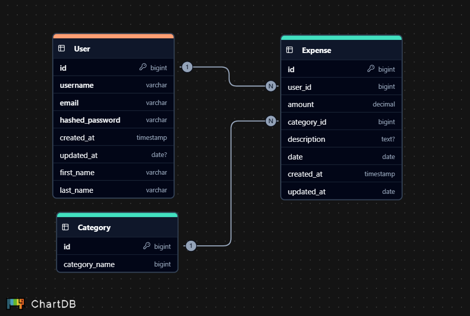

# Expense Tracker API

An API built to help users track their expenses, set budgets, and categorize their spending. This API allows users to manage their expenses with features such as authentication, CRUD operations, and expense categorization.

## Features
- **User Authentication**: Secure user registration, login, and JWT-based authentication.
- **Expense Management**: Create, read, update, and delete expenses.
- **Expense Categories**: Categorize expenses (e.g., Food, Entertainment, etc.).
- **Budgeting**: Set and track monthly spending limits.
- **Recurring Expenses**: Automatically add recurring expenses each month.
- **Export Data**: Export expense data to CSV or PDF.
- **Expense Analytics**: View spending patterns through charts (optional feature).

